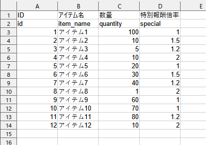

## 機能
### json出力 コマンドラインツール
Excelにパラメータ行を追加することで、Excelのシート名と同じtomlファイルで定義した内容に合わせて、データチェック、json出力

例) xlsxデータにパラメータに対してtoml定義



```toml
# パラメータ開始位置
start_param = 2

# id
[[params]]
name = "id"
type = "int"
unique = true # ユニーク値

# アイテム名
[[params]]
name = "item_name"
type = "string"

# 量
[[params]]
name = "quantity"
type = "int"
[params.range] # 値の範囲
min = 1
max = 100

# 特別報酬倍率
[[params]]
name = "special"
type = "float"
[params.range]
min = 1.0
max = 2.0
```
- typeは`string`, `int`, `float`の3つのみ
- rangeのmin, maxで値の最小値、最大値定義 `int`, `float`のみ
- unique その行のデータすべてがユニークな値かチェック


## 制作期間
3~4日


## 使用技術
- C#
- ライブラリ
    - ExcelDataReader (excel読み込み)
    - ExcelDataReader.DataSet
    - Nett (toml読み込み)
    - Newtonsoft.Json (json読み込み)


