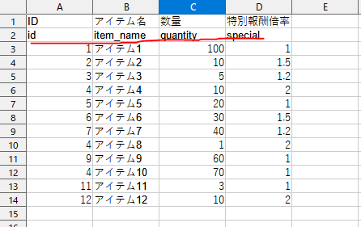

## ExcelからJSON出力
コマンドラインツール。
Excelにパラメータ行を追加し、シート名と同じTOMLファイルを定義してパラメータ毎の型チェックを行い、エラーがなければJSONファイルを出力します。


例) xlsxデータのパラメータをTOMLファイルで定義



```toml
# パラメータ開始位置
start_param = 2

# id
[[params]]
name = "id"
type = "int"

# アイテム名
[[params]]
name = "item_name"
type = "string"

# 量
[[params]]
name = "quantity"
type = "int"

# 特別報酬倍率
[[params]]
name = "special"
type = "float"
```
- typeは`string`, `int`, `float`の3つのみ


## 使用技術
- C#
- ライブラリ
    - ExcelDataReader
    - ExcelDataReader.DataSet
    - Nett
    - Newtonsoft.Json


## 実行方法


※Windowsのみ

1. [excel-analysis-v1.0.0.zip](https://github.com/arakaki-asdf/ExcelAnalysis/releases)をダウンロード&解凍
2. run.batを実行
3. outputフォルダにjsonが出力されることを確認
4. run.batのitem.tomlをitem2.tomlに変更
5. outputフォルダにjsonが出力されることを確認

